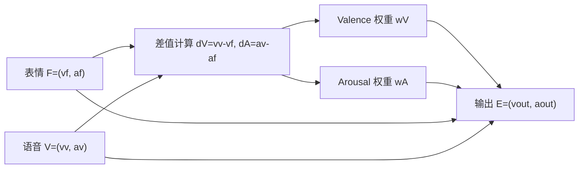

# 从离散规则表到连续函数：多模态情绪融合的可解释结构检验

## 摘要

本研究以一个 7×7 多模态情绪融合规则表为对象，探讨表情与语音两种模态在 Valence-Arousal（VA）空间中是否存在可由低维连续函数近似重建的融合结构。VA 空间继承了情绪维度模型与环形情感模型的思想，即情绪概念可以在愉悦度与激活度等维度上组织起来【引用：[1]；内容：VA/circumplex 情绪空间的理论基础】。传统查表式规则具有直观可解释性，但缺乏连续泛化能力；深度学习式融合虽然灵活，却往往难以解释融合机制。本文尝试在二者之间建立一条中间路径：把离散情绪表转换为 VA 坐标监督数据，再用少量样本训练可解释的融合函数，并检验其对完整 49 格规则表的泛化能力。

实验采用两类核心设定。第一类是原始规则表及其 NRC VAD 仿射对齐版本，用来检验原表内部几何结构是否能够被简单连续模型重建。第二类是 NRC VAD 直接重建版本，即每一格输出情绪词都直接使用词典 VA 坐标，用来检验词典词条几何是否自然符合原规则表的融合结构。本文的 7×7 多模态情绪表继承自研究室前期硕士论文提出的 hierarchical multimodal framework；NRC VAD Lexicon 则提供了基于人工标注的词语 Valence、Arousal、Dominance 分数，是本文引入外部情感坐标的重要依据【引用：[6]；内容：7×7 表格、49 状态和 14 个目标复杂情绪来源】【引用：[7], [8]；内容：NRC VAD 词典及 VAD 坐标来源】。结果显示，原始坐标与 NRC 仿射对齐坐标下，`simple average` 和线性双通道模型都能取得较强泛化；而在 NRC 直接重建坐标下，所有低维模型的 holdout35 误差明显升高。进一步的残差修正、岭回归特征扩展与核残差平滑也未能超过原有线性模型。这说明 7×7 原规则表内部确实存在接近低维连续融合的结构，但词典中单个情绪词的 VA 坐标并不天然服从这种融合几何。

本文的核心结论不是某个复杂模型显著击败平均融合，而是：7×7 多模态情绪融合表的内部结构可以被简单、可解释的连续函数近似描述；这种结构在 NRC 仿射对齐坐标系中仍然保留，但在 NRC 词典直接重建坐标系中显著减弱。`simple average` 因此不是弱 baseline，而是揭示原表几何结构的重要参照。带 \(|d|\) 项的 abs 模型可作为“方向 + 强度”机制解释的扩展，但在 14 样本训练下参数稳定性有限，不宜作为唯一最优模型来主张。nrc_direct 的负结果并非单纯的模型调参失败，而是提示：词典词义空间与多模态融合规则空间之间存在可观的几何错位。

---

## 1. 研究背景与问题

多模态情绪识别通常需要融合表情、语音、文本等不同信息源。Affective Computing 研究强调，计算系统若要更自然地理解和响应人类，就需要识别、解释和处理情绪信息【引用：[2]；内容：Affective Computing 研究背景】。在具体建模上，多模态学习和多媒体融合研究则长期关注不同模态之间的表示、对齐、融合与可靠性问题【引用：[3]-[5]；内容：多模态学习、融合策略和情感计算综述背景】。在表情与语音一致时，融合问题较简单；但当两种模态表达出不同情绪时，系统需要决定最终输出更接近哪一方，或是否形成折中状态。

本项目的起点是研究室前期硕士论文中的 7×7 Hierarchical Matrix。该矩阵以表情情绪为行、语音情绪为列，形成 face × speech 的 49 个复杂情绪交互状态，并进一步标出 14 个目标复杂情绪用于验证【引用：[6]；内容：前期硕论提出的 7×7 matrix、49 状态和 Table14 来源】。本文继承这一离散情绪融合表，而不是重新提出该表格；本文的扩展是把该表格转化为连续 VA 函数，并检验其几何结构与泛化能力。这样的规则表具备两个优点：直观、可解释。但它也有明显限制：只能覆盖固定的 49 个组合，无法自然扩展到连续 VA 空间中的任意输入。

因此本文关注的问题是：

> 一个离散 7×7 多模态情绪融合表，是否可以被一个低维、可学习、可解释的连续函数近似重建？

进一步地，如果把坐标来源换成更权威的 NRC VAD Lexicon，这种低维融合结构是否仍然存在【引用：[7], [8]；内容：NRC VAD 词典坐标来源】？

---

## 2. 方法

### 2.1 VA 表示

每个情绪被表示为二维连续坐标。该设定与 Russell 的环形情感模型一致：情绪概念可以被组织在由愉悦度与激活度等维度构成的空间中【引用：[1]；内容：情绪二维/环形空间理论】。

\[
E=(v,a)
\]

其中 \(v\) 表示 Valence，即情绪正负向；\(a\) 表示 Arousal，即激活度。

两个输入模态为：

\[
F=(v_f,a_f)
\]

\[
V=(v_v,a_v)
\]

目标输出为：

\[
E_{out}=(v_{out},a_{out})
\]

### 2.2 从离散规则到连续监督数据

7 个基础情绪两两组合，共形成 49 个训练或评估样本。该 Full49 结构来自前期硕士论文提出的 7×7 Hierarchical Matrix【引用：[6]；内容：Full49 的 7×7 face × speech 状态空间来源】：

\[
\mathcal{D}_{full}=\{(F_i,V_i,E_i)\}_{i=1}^{49}
\]

为了检验少样本泛化能力，本文采用 Table14 -> Holdout35 协议。其中 Table14 对应该硕士论文中标出的 14 个 target complex emotions【引用：[6]；内容：14 个目标复杂情绪的选择依据】：

- Table14：从 49 格中选出 14 个复杂情绪组合用于训练。
- Holdout35：剩余 35 格用于泛化评估。
- Full49：完整 49 格用于整体拟合质量评估。

这套协议的意义是：如果模型只用 14 个监督样本就能较好预测剩余 35 格，那么说明前期 7×7 规则表内部存在可被连续函数捕捉的结构，而不是单纯记忆查表结果。换句话说，本文关注的是对前人离散矩阵的连续化和结构检验，而不是重新设计 49 个情绪标签。

### 2.3 融合模型

#### Simple Average

最重要的 baseline 是简单平均：

\[
E_{pred}=\frac{F+V}{2}
\]

也就是：

\[
v_{pred}=\frac{v_f+v_v}{2},\quad a_{pred}=\frac{a_f+a_v}{2}
\]

它不学习参数，也不区分模态可信度，只假设表情与语音各占一半。

#### 线性双通道模型

线性模型把 Valence 与 Arousal 分开融合：

\[
d_V=v_v-v_f,\quad d_A=a_v-a_f
\]

\[
w^V=\sigma(a_Vd_V+b_V),\quad w^A=\sigma(a_Ad_A+b_A)
\]

\[
v_{out}=v_f+w^V(v_v-v_f)
\]

\[
a_{out}=a_f+w^A(a_v-a_f)
\]

其中 \(w^V,w^A\) 表示语音在两个维度上的动态权重。

#### Abs 机制扩展模型

abs 模型进一步加入 \(|d|\)：

\[
w=\sigma(a_1d+a_2|d|+b)
\]

其中：

- \(d\)：方向，表示语音相对于表情更高还是更低。
- \(|d|\)：强度，表示两种模态不一致的幅度。
- \(b\)：基线偏置。

该模型的价值主要在机制解释：它允许把“方向”与“冲突强度”分开讨论。但稳定性检验显示，在 14 个训练样本下，\(|d|\) 项尤其是 Arousal 通道参数会出现较大波动，因此本文不把 abs 模型写成唯一最优模型。

### 2.4 机制示意图

这张图对应本文的核心思想：不直接查表，而是先计算两种模态在 VA 空间中的差值，再用差值决定融合权重，最后输出连续 VA 坐标。

---

## 3. 实验设计

### 3.1 三套坐标系

本文比较三套坐标构造方式。

**native**

使用项目早期手工设定或规则表中已有的 VA 坐标。它最直接反映原始 7×7 表的内部结构。

**nrc_affine**

先从 NRC VAD Lexicon 中取 7 个基础情绪锚点，例如 happy、sad、angry、fear、disgust、surprise、neutral。然后用这 7 个锚点拟合从原坐标到 NRC 坐标的二维仿射变换，并把该变换作用到整个 49 格规则表【引用：[7], [8]；内容：NRC VAD 词典提供基础情绪词的 VAD 坐标】。

这意味着：坐标尺度与方向被 NRC 校准，但原规则表的内部相对结构仍然保留。需要强调的是，nrc_affine 并不要求转换后的 49 个坐标都能在 NRC 中找到完全一一对应的词条。只有 7 个基础情绪锚点直接来自 NRC；其余融合情绪坐标是由同一个仿射变换从原 7×7 表映射得到的。因此，nrc_affine 的目的不是“用 NRC 替换全部表格”，而是检验原表融合几何在 NRC 尺度下是否仍然成立。

**nrc_direct**

每一格输出情绪词都直接从 NRC VAD Lexicon 中查找 VA 坐标，或使用可解释的近义词回退，例如 disillusioned -> disillusionment、grossed out -> gross【引用：[7], [8]；内容：nrc_direct 的词条 VA 坐标来源】。

这意味着：每一格坐标都具有词典来源，但原规则表的几何结构不再被强制保留。

### 3.2 对照方法

实验统一比较以下方法。这里的 fixed weight、linear 与 abs 都可以看作融合策略的简化实例；多模态融合文献通常会从特征级、决策级、混合融合以及更一般的表示、对齐、融合等问题讨论这些策略【引用：[3], [4]；内容：多模态融合策略和任务分类背景】。

- face only：只输出表情坐标。
- voice only：只输出语音坐标。
- fixed weight：固定权重融合，包括 0.25、0.5、0.75。
- linear：线性双通道权重模型。
- abs：加入 \(|d|\) 的机制扩展模型。

### 3.3 nrc_direct 的补充诊断模型

由于 nrc_direct 的误差明显高于 native 与 nrc_affine，本文进一步加入一组补充诊断。目的不是引入黑盒模型，而是判断问题到底来自“融合权重函数不够好”，还是来自“目标词典坐标本身已经偏离表情 F 与语音 V 之间的融合线段”。

补充实验包括四类：

- F-V 线段距离诊断：计算每个 nrc_direct 目标点到表情坐标 F 与语音坐标 V 所形成线段的最短距离。如果目标点本身离这条线段很远，那么任何只在 F 与 V 之间插值的模型都会受到结构限制。
- residual ridge：先用当前融合模型得到预测，再用低维正则化回归学习残差修正，让输出可以轻微离开 F-V 直线。
- feature ridge：使用 \(F,V,d,|d|\)、冲突幅度与简单交互项作为特征，通过岭回归学习输出坐标。
- kernel residual：假设相似输入组合会有相似误差，用 Table14 中的残差对 Holdout35 做平滑修正。

这些模型仍然遵守 Table14 -> Holdout35 协议：训练只使用 14 个目标复杂情绪，评估仍然看剩余 35 格，不把 holdout 的答案用于调参。

### 3.4 nrc_affine 的 NRC 最近邻标签解释

为避免把坐标建模和词语命名混在一起，本文进一步采用“nrc_affine 坐标 + NRC 最近邻标签解释”的方案。具体做法是：先固定 nrc_affine 得到的 49 个连续坐标，再在 NRC VAD 中只对候选情绪词进行最近邻检索，观察每个坐标附近有哪些情绪词。

这个步骤不是重新训练模型，也不是把 49 格坐标直接替换成 NRC 词条坐标。它只是一个标签解释和标签审查工具：

- 如果原表标签对应的 NRC 坐标离 nrc_affine 坐标较近，说明该标签与当前 VA 几何比较一致。
- 如果距离较远，说明该格可以作为后续人工复查候选。
- 最近邻词只提供几何参考，不自动等同于更正确的情绪标签。

因此，nrc_affine 负责“保留原表融合结构并对齐到 NRC 尺度”，NRC 最近邻负责“解释坐标附近可能对应的情绪词”。二者结合，比直接使用 nrc_direct 更适合作为本文主线。

### 3.5 指标

使用 MSE 与两个维度的 \(R^2\)：

\[
MSE=\frac{1}{N}\sum_i \|E_i-\hat{E}_i\|^2
\]

\[
R^2=1-\frac{\sum_i(y_i-\hat{y_i})^2}{\sum_i(y_i-\bar{y})^2}
\]

本文主要以 holdout35 MSE 判断少样本泛化能力。

---

## 4. 结果

### 4.1 三套坐标系下的最佳方法对照

表 1 展示每套坐标系在 holdout35 上排名最好的方法。

| 坐标系 | 最佳方法 | holdout35 MSE | R² Valence | R² Arousal | full49 MSE | train14 MSE |
|---|---|---:|---:|---:|---:|---:|
| native | simple average | 0.0148 | 0.9506 | 0.9460 | 0.0126 | 0.0070 |
| nrc_affine | linear ap_bn | 0.0509 | 0.9102 | 0.7439 | 0.0412 | 0.0170 |
| nrc_direct | linear an_bp | 0.3592 | 0.5370 | 0.3763 | 0.3114 | 0.1920 |

这个结果说明：

1. 原始坐标下，简单平均已经非常接近规则表结构。
2. NRC 仿射对齐后，低维融合结构仍然存在，linear 模型略优于 simple average。
3. NRC 直接重建后，最佳模型误差显著升高，说明词典词条坐标打散了原规则表的融合几何。

### 4.2 Simple Average、Linear 与 Abs 的对照

表 2 展示三类代表方法在 holdout35 上的表现。

| 坐标系 | 方法 | case | holdout35 MSE | R² Valence | R² Arousal |
|---|---|---|---:|---:|---:|
| native | simple average | fixed w=0.5 | 0.0148 | 0.9506 | 0.9460 |
| native | linear | ap_bp | 0.0160 | 0.9443 | 0.9460 |
| native | abs | ap_bn | 0.0277 | 0.9456 | 0.8382 |
| nrc_affine | simple average | fixed w=0.5 | 0.0516 | 0.9137 | 0.7287 |
| nrc_affine | linear | ap_bn | 0.0509 | 0.9102 | 0.7439 |
| nrc_affine | abs | ap_bp | 0.0559 | 0.9085 | 0.7007 |
| nrc_direct | simple average | fixed w=0.5 | 0.4297 | 0.4594 | 0.2392 |
| nrc_direct | linear | an_bp | 0.3592 | 0.5370 | 0.3763 |
| nrc_direct | abs | an_bp | 0.4044 | 0.5714 | 0.1938 |

这个表是本文写作口径调整的关键证据。它表明 simple average 不是一个弱 baseline，而是 native 与 nrc_affine 中非常强的参照模型。换句话说，原规则表本身很大程度上接近“表情与语音坐标取中点”的连续结构。

因此，本文不应把主要贡献写成复杂模型数值上击败平均融合，而应写成：

> 平均融合与简单线性模型已经能够重建大量原表结构，这说明原 7×7 规则表内部确实具有低维连续几何；当坐标改为 NRC 直接词条坐标后，这种结构明显减弱。

### 4.3 稳定性检验

为了检查 14 个样本是否足以稳定支持 abs 机制解释，本文对 nrc_affine + abs + ap_bn 做了两类检验：

- bootstrap：对 14 个训练样本有放回重采样 80 次。
- leave-one-out：每次去掉 1 个训练样本，共 14 次。

表 3 展示主要稳定性结果。

| 检验方式 | 指标 | mean | sd | 2.5% | median | 97.5% |
|---|---|---:|---:|---:|---:|---:|
| bootstrap | holdout35 MSE | 0.1036 | 0.0571 | 0.0537 | 0.0676 | 0.2190 |
| bootstrap | holdout35 R² Valence | 0.8804 | 0.0681 | 0.6251 | 0.8988 | 0.9126 |
| bootstrap | holdout35 R² Arousal | 0.3142 | 0.5581 | -0.8454 | 0.6831 | 0.7285 |
| leave-one-out | holdout35 MSE | 0.0591 | 0.0053 | 0.0569 | 0.0573 | 0.0718 |
| leave-one-out | holdout35 R² Valence | 0.9052 | 0.0042 | 0.8954 | 0.9061 | 0.9099 |
| leave-one-out | holdout35 R² Arousal | 0.6786 | 0.0534 | 0.5562 | 0.6936 | 0.6964 |

leave-one-out 结果相对稳定，说明单个样本的删除不会让整体结论崩溃。但 bootstrap 波动明显更大，尤其 Arousal 通道的 2.5% 分位数为负，说明在样本重复和缺失更剧烈的情况下，abs 模型的 Arousal 机制并不稳定。

因此本文对 abs 模型的定位是：它是有解释价值的机制扩展，但在当前样本规模下不应被描述为稳定最优模型。

### 4.4 nrc_direct 性能突破尝试与几何诊断

为了确认 nrc_direct 的高误差是否可以通过低复杂度修正改善，本文进一步比较了 residual ridge、feature ridge 与 kernel residual。表 4 展示这些补充模型在 holdout35 上的结果。

| 方法 | holdout35 MSE | R² Valence | R² Arousal | 说明 |
|---|---:|---:|---:|---|
| linear an_bp | 0.3592 | 0.5370 | 0.3763 | 原有最佳低维插值模型 |
| kernel residual | 0.3639 | 0.5371 | 0.3613 | 相似输入组合的残差平滑修正 |
| residual ridge | 0.3757 | 0.5221 | 0.3406 | 在基础预测上学习低维残差 |
| abs an_bp | 0.4044 | 0.5714 | 0.1938 | 方向 + 强度机制扩展 |
| feature ridge | 2.1701 | -2.7705 | -1.6750 | 特征扩展后过拟合明显 |

结果显示，新增半解释模型没有明显突破 nrc_direct 的性能瓶颈。其中最接近原有最佳模型的是 kernel residual，但其 holdout35 MSE 为 0.3639，仍略高于 linear an_bp 的 0.3592。leave-one-out 稳定性检验中，kernel residual 的 holdout35 MSE 平均为 0.3686，标准差为 0.0170，说明它没有出现严重崩坏，但也没有带来实质性提升。

几何诊断进一步解释了这一点。nrc_direct 目标点到 F-V 线段的平均距离为 0.2552，最大距离为 1.3900，并且 49 格中有 8 格的目标点投影落在线段外。距离最大的组合包括 Happy|Surprised、Surprised|Sad、Surprised|Neutral、Neutral|Angry 与 Disgusted|Angry。这说明一部分 nrc_direct 目标词坐标不是简单落在“表情坐标到语音坐标”的中间区域，而是被词语本身的语义含义拉到了另一处位置。

因此，nrc_direct 的低性能不应简单解释为“模型还不够复杂”。在当前只使用表情与语音基础情绪坐标作为输入的设定下，词典词条坐标中的一部分偏移无法被低维融合函数稳定恢复。

---

## 5. 讨论

### 5.1 为什么 simple average 很强

simple average 在 native 与 nrc_affine 中表现很强，说明前期硕士论文提出的 7×7 表中，许多输出点位于表情坐标与语音坐标之间，且接近二者中点【引用：[6]；内容：所分析的原始 7×7 表格来源】。这不是坏消息，反而是重要发现：它揭示原 7×7 表并非完全任意的离散规则，而是具有明显的连续几何结构。相对于前期工作的 7×7 hierarchical decision logic，本文的贡献是把该离散规则表推进到连续函数建模、NRC 坐标复现、baseline 对照和稳定性检验。

这也解释了为什么线性双通道模型可以取得相近表现。线性模型本质上是在 simple average 附近学习可解释的偏置项和方向敏感度。如果原表本身已经非常接近中点融合，复杂模型不一定会显著提高泛化性能。

### 5.2 为什么 nrc_direct 明显变弱

nrc_direct 中，每一格输出由具体情绪词在 NRC VAD 中的词条坐标决定。NRC VAD 的目标是为词语或短语提供人工标注的 Valence、Arousal、Dominance 规范分数【引用：[7], [8]；内容：NRC VAD 词条规范分数的来源与规模】。因此，词典坐标反映的是单词本身的平均情感含义，而不是“表情情绪 + 语音情绪”的融合结果。

例如，一个复杂情绪词可能在语义上接近某种社会评价、认知状态或情境解释，而不一定落在两个基础情绪坐标的中间。因此，当 Full49 完全由 NRC 词条坐标直接重建时，原先的低维融合结构会被削弱。

补充实验支持这一解释。目标点到 F-V 线段的距离诊断显示，nrc_direct 中有若干输出点明显远离表情与语音两点之间的插值路径；其中 Happy|Surprised 的距离达到 1.3900。换句话说，即便融合权重函数学习得很好，只要模型形式仍然主要在 F 与 V 之间移动，它也很难预测这些远离线段的词典目标点。

同时，residual ridge、feature ridge 与 kernel residual 三类补充模型都未能超过原有 linear an_bp。这说明 nrc_direct 的困难不只是“缺一个小修正项”，而更可能来自输入信息不足：仅凭 face/voice 两个基础情绪坐标，难以恢复某些复杂情绪词在词典空间中的语义位置。

这使 nrc_direct 成为一个重要反证：

> 权威词典坐标并不自动产生融合几何；原规则表中的连续结构更像是一种人工设计或规则内生的融合结构。

### 5.3 Abs 模型的价值与限制

abs 模型引入 \(|d|\)，允许把冲突方向与冲突强度分开解释。它适合回答机制问题，例如：

- 当语音比表情更正向时，模型是否更偏向语音？
- 当两种模态差异更大时，模型是否更倾向折中？
- Valence 与 Arousal 是否采取不同融合策略？

但当前证据不支持把 abs 模型写成稳定最优。bootstrap 结果显示，其参数，尤其是 Arousal 通道的强度项，容易被少量样本扰动。因此更稳妥的表述是：abs 模型提供一种有解释力的候选机制，但需要更多高冲突样本来确认。

### 5.4 标签优化的定位

基于 NRC 最近邻的标签解释应作为附加分析，而不是主模型本身。它能够检查 nrc_affine 坐标附近有哪些候选情绪词，从而帮助人工审阅原表标签是否与 VA 几何一致【引用：[7], [8]；内容：最近邻标签建议所依赖的 NRC VAD 词典坐标】。

本研究新增了 nrc_affine 最近邻解释结果。分析时不在 NRC 全词典中无筛选检索，因为那会返回大量普通词，而是把原 7×7 表中出现过的复杂情绪标签作为候选集合。结果显示，在 49 个格子中，原标签与 nrc_affine 坐标距离较近的格子有 5 个，弱一致的格子有 13 个，需要复查的格子有 31 个。原标签到 nrc_affine 坐标的平均距离为 0.5173，中位数为 0.4610，最大距离为 1.4434。

这个结果说明：nrc_affine 本身不应被理解为“每个坐标都能直接对应一个 NRC 词条”。更合理的用法是把 nrc_affine 作为连续坐标主线，把 NRC 最近邻作为标签审查工具。例如 Happy|Surprised 的原标签 Calm 与 nrc_affine 坐标距离较远，而附近候选更接近 Amused、Astound、Joyful、Amazed、Excited 一类高 valence / 高 arousal 词。这不是说必须把 Calm 自动改掉，而是说明该格在“融合几何”和“词义标签”之间存在值得讨论的差异。

因此，最近邻只保证几何距离接近，不保证语义完全正确。标签优化不应放在主线核心，而应作为后续的标签一致性审查工具。

---

## 6. 结论

本文从一个 7×7 多模态情绪融合规则表出发，检验其是否可以被低维连续函数重建。实验结果支持以下结论：

1. 继承自前期硕士论文的原始 7×7 规则表内部存在明显的低维连续融合结构【引用：[6]；内容：原始 7×7 规则表来源】。
2. `simple average` 是强 baseline，说明大量规则输出接近表情与语音坐标的中点。
3. 线性双通道模型在 nrc_affine 中略优于 simple average，说明简单可解释模型足以捕捉主要结构。
4. nrc_direct 中所有低维模型表现明显变弱，说明 NRC 词条 VA 坐标与原规则表融合几何之间存在系统性偏差。
5. 对 nrc_direct 加入 residual ridge、feature ridge 与 kernel residual 后仍未明显改善，说明这种偏差不能靠简单残差修正稳定解决。
6. nrc_affine 与 NRC 最近邻标签解释应分开使用：前者用于连续坐标建模，后者用于审查坐标附近可能对应的情绪词。
7. abs 模型能表达“方向 + 强度”的机制假设，但在当前 14 样本训练下参数稳定性有限。

因此，本项目最稳妥的研究贡献是：

> 7×7 多模态情绪融合表不是孤立的离散查表规则，而是包含可被简单连续函数近似描述的几何结构；这种结构在 NRC 仿射对齐坐标中保留，但在 NRC 词典直接坐标中被显著削弱。因此，最稳妥的方案不是强制让 49 个融合坐标全部对应 NRC 词条，而是用 NRC 基础情绪锚点校准坐标，用 nrc_affine 保留原表融合结构，再用 NRC 最近邻作为标签解释和复查工具。

---

## 7. 参考文献与引用内容说明

本文采用编号引用格式，例如 [1]、[2]。每条参考文献后附“本文引用内容”，说明该文献在本文中具体支撑哪一类表述。

[1] Russell, J. A. (1980). A circumplex model of affect. *Journal of Personality and Social Psychology, 39*(6), 1161-1178. https://doi.org/10.1037/h0077714  
本文引用内容：用于支撑 VA 空间和情绪环形/维度表示的理论背景，即情绪概念可以在愉悦度、激活度等维度构成的空间中组织。

[2] Picard, R. W. (1997). *Affective Computing*. Cambridge, MA: MIT Press. https://mitpress.mit.edu/9780262161701/affective-computing/  
本文引用内容：用于支撑 Affective Computing 的研究背景，即计算系统需要识别、理解和处理人类情绪，以实现更自然的人机交互。

[3] Baltrušaitis, T., Ahuja, C., & Morency, L.-P. (2019). Multimodal machine learning: A survey and taxonomy. *IEEE Transactions on Pattern Analysis and Machine Intelligence, 41*(2), 423-443. https://doi.org/10.1109/TPAMI.2018.2798607  
本文引用内容：用于支撑多模态学习的一般问题框架，包括 representation、alignment、fusion、co-learning 等挑战；也用于说明本文工作属于可解释融合结构检验。

[4] Atrey, P. K., Hossain, M. A., El Saddik, A., & Kankanhalli, M. S. (2010). Multimodal fusion for multimedia analysis: A survey. *Multimedia Systems, 16*(6), 345-379. https://doi.org/10.1007/s00530-010-0182-0  
本文引用内容：用于支撑多模态融合策略的背景，包括特征级、决策级、混合融合，以及模态相关性、置信度、同步和最优模态选择等问题。

[5] Poria, S., Cambria, E., Bajpai, R., & Hussain, A. (2017). A review of affective computing: From unimodal analysis to multimodal fusion. *Information Fusion, 37*, 98-125. https://doi.org/10.1016/j.inffus.2017.02.003  
本文引用内容：用于支撑情感计算从单模态分析走向多模态融合的研究背景，并说明音频、视觉、文本等信息融合是情绪识别中的重要方向。

[6] Savaliya, J. (2026). *An Investigation of a Hierarchical Multimodal Framework for Modeling Complex Emotions* [Master's thesis, Shibaura Institute of Technology].  
本文引用内容：用于支撑本文 7×7 情绪表格的直接来源，包括 7×7 Hierarchical Matrix、face × speech 的 49 状态设定、14 个 target complex emotions 的选择，以及原研究中的 facial-anchor / hierarchical decision logic 背景。本文在此基础上进一步做连续 VA 函数化、NRC 坐标对齐、baseline 对照和稳定性检验。

[7] Mohammad, S. M. (2018). Obtaining reliable human ratings of valence, arousal, and dominance for 20,000 English words. *Proceedings of the 56th Annual Meeting of the Association for Computational Linguistics*, 174-184. https://doi.org/10.18653/v1/P18-1017  
本文引用内容：用于支撑 NRC VAD Lexicon v1 的来源和可靠性，即该词典为英文词语提供人工标注的 Valence、Arousal、Dominance 分数。

[8] Mohammad, S. M. (2025). NRC VAD Lexicon v2: Norms for Valence, Arousal, and Dominance for over 55k English terms. *arXiv preprint arXiv:2503.23547*. https://doi.org/10.48550/arXiv.2503.23547  
本文引用内容：用于支撑本项目使用的 NRC VAD Lexicon v2.1 相关背景，即新版词典扩展到 55k 以上英文词和短语，为 nrc_affine 与 nrc_direct 坐标构造提供外部词典依据。

---

## 8. 当前证据文件

本报告主要依据以下结果文件：

- [research_progress.md](file:///Users/mac/Documents/trae_projects/jenish/research_progress.md)
- [summary.md](file:///Users/mac/Documents/trae_projects/jenish/report_assets/10_model_evidence/summary.md)
- [baseline_model_comparison.csv](file:///Users/mac/Documents/trae_projects/jenish/report_assets/10_model_evidence/baseline_model_comparison.csv)
- [stability_abs_ap_bn_nrc_affine.csv](file:///Users/mac/Documents/trae_projects/jenish/report_assets/10_model_evidence/stability_abs_ap_bn_nrc_affine.csv)
- [analyze_model_evidence.py](file:///Users/mac/Documents/trae_projects/jenish/analyze_model_evidence.py)
- [nrc_direct_breakthrough_summary.md](file:///Users/mac/Documents/trae_projects/jenish/report_assets/11_nrc_direct_breakthrough/summary.md)
- [nrc_direct_model_comparison.csv](file:///Users/mac/Documents/trae_projects/jenish/report_assets/11_nrc_direct_breakthrough/model_comparison.csv)
- [segment_distance_diagnostics.csv](file:///Users/mac/Documents/trae_projects/jenish/report_assets/11_nrc_direct_breakthrough/segment_distance_diagnostics.csv)
- [analyze_nrc_direct_breakthrough.py](file:///Users/mac/Documents/trae_projects/jenish/analyze_nrc_direct_breakthrough.py)
- [nrc_affine_label_interpretation_summary.md](file:///Users/mac/Documents/trae_projects/jenish/report_assets/12_nrc_affine_label_interpretation/summary.md)
- [nrc_affine_label_interpretation.csv](file:///Users/mac/Documents/trae_projects/jenish/report_assets/12_nrc_affine_label_interpretation/nrc_affine_label_interpretation.csv)
- [orig_label_distance_heatmap.png](file:///Users/mac/Documents/trae_projects/jenish/report_assets/12_nrc_affine_label_interpretation/orig_label_distance_heatmap.png)
- [analyze_nrc_affine_label_interpretation.py](file:///Users/mac/Documents/trae_projects/jenish/analyze_nrc_affine_label_interpretation.py)
