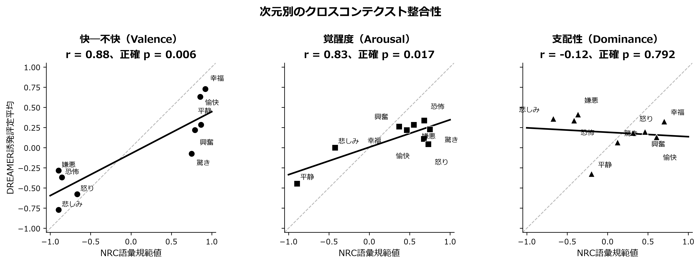
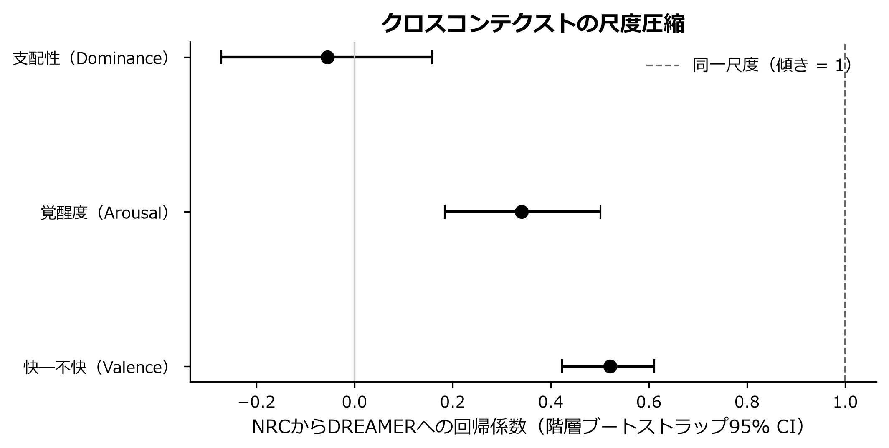
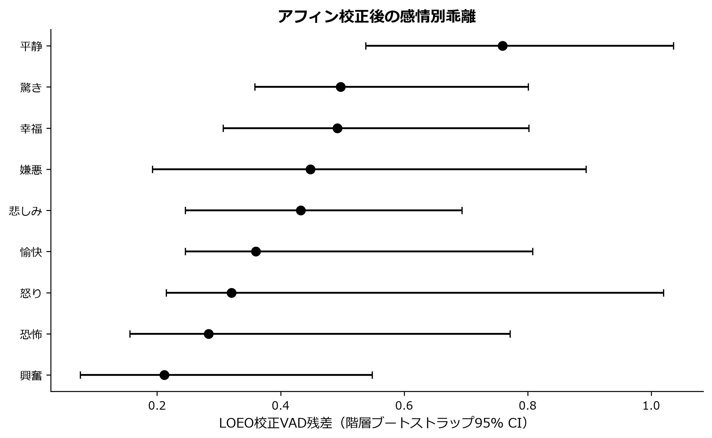
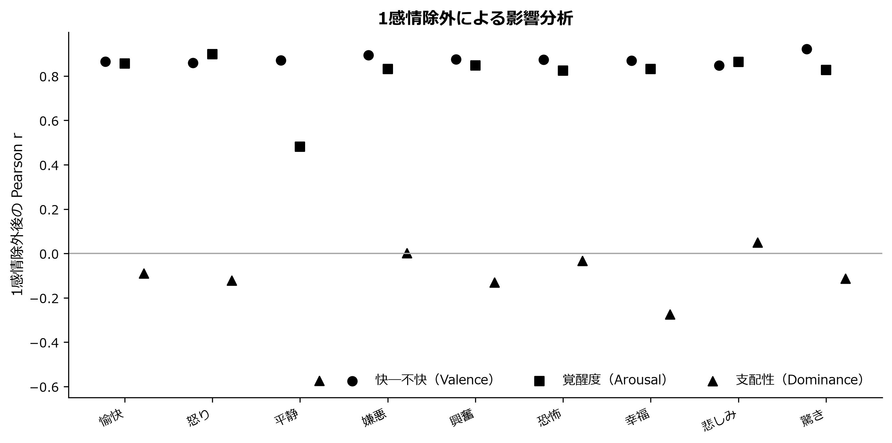

# 語彙的VAD規範と映像誘発感情のクロスコンテクスト整合性

## DREAMER × NRC-VAD 完全分析報告書

**報告日：2026年7月30日**

**研究段階：探索的二次データ分析・論文化準備**
**英語題目案：** *From Emotion Words to Elicited Experience: Dimension-Specific Cross-Context Alignment Between NRC-VAD and DREAMER*

---

## エグゼクティブ・サマリー

本研究は、感情語に付与されたValence、Arousal、Dominance（VAD）座標が、映像刺激によって実際に誘発された主観的感情体験にどの程度適用できるかを検討したものである。NRC-VAD v2.1における9つの英語感情名詞と、DREAMERにおける23名、18映像、414試行の映像視聴後VAD評定を共通の `[-1, 1]` 空間に配置した。

研究の中心的な問いは、「両者が同一か」ではなく、「語彙的感情構造が誘発体験へどの程度移送可能か」である。感情語の評定は共有された意味知識を表す一方、映像後の評定は特定の刺激、参加者、文脈、時間に依存するため、同じVADという名称だけで両者を交換可能と仮定することはできない。

主な結果は次の通りである。

- **Valence**は強く安定したクロスコンテクスト対応を示した。Pearson `r=.875`、Holm補正後 `p=.0184`、階層ブートストラップ95% CI `[.762, .920]` であった。
- **Arousal**はPearson相関では対応したが、順位相関は有意でなかった。すなわち全体的な線形傾向は共有される一方、個々の感情の順位は不安定であった。
- **Dominance**には対応の証拠がなかった。Pearson `r=-.121`、Holm補正後 `p=.7923` であった。
- V/A/Dの意味軸を回転させずに比較した三次元全体の構成一致度は `C=.529`、厳密置換 `p=.0058` であり、空間全体としてはランダム以上の対応が認められた。
- DREAMERのValenceとArousalはNRCより中心付近に圧縮されていた。NRCからDREAMERへの回帰傾きはVで`.520`、Aで`.341`であった。
- 全体的な尺度差を除いた後では、**calmness**の残差点推定が最大であった。ただし、多くの感情で信頼区間が重なるため、確定的な順位とは解釈できない。
- EEG・ECGの粗粒度特徴は、映像を統制した個人レベルのVAD差を説明しなかった。これは生理信号が感情と無関係であることを意味しない。

本研究の中心的な結論は以下である。

> **語彙VADは誘発感情体験の一部の構造を保持するが、その移送可能性は次元と感情カテゴリーに依存し、両者を無条件に交換可能な測定として扱うことはできない。**

---

# 1. 研究背景

## 1.1 VADモデル

VADモデルは感情を次の三次元で表現する。

- **Valence（感情価）**：不快・ネガティブから快・ポジティブまで
- **Arousal（覚醒度）**：沈静・低活性から興奮・高活性まで
- **Dominance（支配感・統制感）**：支配されている感覚から、自分が状況を統制している感覚まで

このモデルは、感情語、画像、映像、音声、生理信号研究、主観的感情経験などを共通の連続空間で扱える点に利点がある。一方、形式的に同じ三次元座標を利用していても、各研究が測定している対象は異なる可能性がある。

## 1.2 語彙的VADと誘発体験VADの違い

NRC-VADのような語彙規範では、評価者はある単語が一般的にどのような感情的意味を持つかを判断する。これは社会的に共有された語彙知識、感情概念、典型性を含む。

対して、DREAMERのVADは、参加者が特定の映像を見た直後に報告した状態である。この評定には以下が影響する。

- 映像の内容、音響、時間、編集
- 参加者の過去経験、気分、個人差
- 刺激が実際にどの程度感情を誘発したか
- 評定時点と尺度の理解
- 映像中の人物ではなく、自分自身を評価できているか

Barrett（2004）は、経験された感情の自己報告が、感情語の意味構造と関連しながらも、単なる語彙知識では説明できないことを示した。Robinson and Clore（2002）も、即時的な感情報告は現在の体験情報に依存しやすい一方、一般的・回顧的判断は感情についての信念や意味知識に依存しやすいと論じている。

したがって、語彙VADと誘発VADは「無関係」でも「同一」でもなく、**どの程度構造を共有し、どこで異なるかを測定する対象**である。

## 1.3 なぜこの比較が必要か

心理学、自然言語処理、感情コンピューティングでは、同じVAD形式を持つ複数のデータが接続される。しかし、測定文脈を無視すると次の問題が生じる。

1. 感情語の意味を、実際の感情経験の代替値として過剰に利用する。
2. データベース全体の範囲差を、特定感情の心理的差として誤解する。
3. Valenceで成立した対応をArousalやDominanceにも一般化する。
4. 異なる参加者集団や尺度の差を、刺激モダリティの因果効果と誤認する。
5. 語彙ラベルを生理信号の「客観的な正解」として扱う。

本研究は、これらの問題を**クロスコンテクスト整合性**と**トランスポータビリティ**の問題として整理する。

---

# 2. 研究目的と研究質問

## 2.1 研究目的

1. NRC-VADとDREAMERの感情カテゴリー構造が、V、A、Dの各次元で対応するか検証する。
2. 両データ間の差を、全体的な尺度の平行移動・圧縮と、感情固有の偏差に分ける。
3. 尺度差を調整した後も大きな残差を持つ感情を特定する。
4. 結果が単一カテゴリー、語形、Dominanceの方向に依存するか検証する。
5. EEG・ECG特徴が個人レベルのVAD差を説明するか探索的に検討する。

## 2.2 研究質問

- **RQ1**：語彙VADと誘発体験VADは、V、A、Dそれぞれでカテゴリー構造を共有するか。
- **RQ2**：両データの差は、どの程度が全体的な尺度圧縮で説明されるか。
- **RQ3**：全体的な尺度変換を除いた後も、特異的な偏差を持つ感情はあるか。
- **RQ4**：結論は特定の感情カテゴリーや語形選択に依存していないか。
- **RQ5（探索的）**：EEG・ECGの基線補正特徴は、個人レベルのVAD対齐距離と関連するか。

## 2.3 分析前の理論的予想

- Valenceは正負の感情カテゴリーを組織する主要軸であり、比較的高い対応が期待される。
- Arousalは刺激強度や時間経過に依存するため、線形傾向は共有しても順位が変化する可能性がある。
- Dominanceは語彙意味におけるpower/controlと、映像後の自己統制感で参照対象が異なり、対応が弱い可能性がある。

本研究は二次データによる探索的研究であるため、これらを強い確認的仮説とは位置づけない。

---

# 3. データ

## 3.1 DREAMER

| 項目 | 内容 |
|---|---|
| バージョン | DREAMER v1.0.2 |
| 参加者 | 23名 |
| 映像刺激 | 18本 |
| 感情カテゴリー | 9種類 |
| カテゴリーあたり刺激数 | 2本 |
| 総試行数 | 414 |
| 主観評定 | Valence、Arousal、Dominance |
| 評定尺度 | 1～5 |
| EEG | 14チャンネル、128 Hz |
| ECG | 2チャンネル、256 Hz |

対象感情はamusement、anger、calmness、disgust、excitement、fear、happiness、sadness、surpriseである。

## 3.2 NRC-VAD

NRC-VAD v2.1から、DREAMERの9カテゴリーに対応する英語感情名詞を抽出した。主分析にはカテゴリー名と同一の名詞を用い、状態形容詞による対応付けを感度分析に用いた。

主分析を名詞に固定した理由は、DREAMERのターゲットが離散的な感情カテゴリー名として定義されており、名詞が最も透明な対応規則だからである。結果に合わせて語形を選択することを避けるため、形容詞は主分析に置き換えず、頑健性の確認に限定した。

## 3.3 尺度変換

DREAMERの1～5評定は次式で `[-1, 1]` に変換した。

```text
transformed score = (score - 3) / 2
```

この線形変換は尺度の中央を0、最小を-1、最大を1に対応させる。ただし、両データの心理的単位が等価になることを保証するものではない。そのため、絶対座標距離とは別に、尺度校正後の残差も分析した。

## 3.4 推論単位

本研究でNRC側に存在する独立した対応点は9つの感情カテゴリーである。したがって、クロスデータベース相関の統計的単位は**9カテゴリー**であり、414試行ではない。

414試行は以下に利用した。

- DREAMERカテゴリー平均の推定
- 参加者間不確実性の推定
- 映像と参加者を再標本化する階層ブートストラップ
- 探索的な個人レベル生理モデル

---

# 4. 分析方法

## 4.1 次元別相関

各次元について以下を計算した。

- **Pearson相関**：両データ間の線形対応
- **Spearman順位相関**：感情カテゴリーの順位対応

Pearsonが高くSpearmanが低い場合、全体として直線的傾向があっても、個々の感情順位は保存されていないと解釈する。

## 4.2 厳密置換検定

9カテゴリーのすべての並べ替え、

```text
9! = 362,880
```

を列挙した。各置換でNRCとDREAMERのカテゴリー対応を入れ替え、観測相関以上に極端な値が得られる割合を厳密p値とした。ランダムな一部置換ではなく全置換を用いている。

V、A、Dの三つの検定についてHolm法で多重比較補正を行った。PearsonとSpearmanは異なる研究質問を表すため、それぞれの系列内で補正した。

## 4.3 階層ブートストラップ

5,000回の再標本化を行った。

1. 23名の参加者を復元抽出する。
2. 各感情カテゴリー内の2映像を復元抽出する。
3. 再標本化されたカテゴリー平均を計算する。
4. 相関、回帰傾き、三次元構成一致度、LOEO残差を再計算する。

これにより、参加者と映像に由来する不確実性を同時に反映した。ただし、各感情の映像が2本しかないため、広い刺激母集団に対する不確実性を十分に推定できるわけではない。

## 4.4 三次元構成一致度

両データのV、A、Dをデータセット内でそれぞれ標準化し、対応する三軸のベクトル一致度を計算した。

この指標ではV/A/D軸を回転させない。無制約のProcrustes回転を許すと、ValenceとArousalを混ぜて適合度を高める可能性があるため、本研究の「同じ次元が対応するか」という問いに合わない。

## 4.5 全体的な尺度写像

各次元で次式を推定した。

```text
DREAMER = intercept + slope × NRC
```

- 傾きが1：両データの範囲がほぼ同等
- 0～1：DREAMERがNRCより中心方向に圧縮
- 0付近：NRC座標がDREAMERをほぼ予測しない
- 負：方向が反対

## 4.6 生のVAD距離

各感情について次の三次元ユークリッド距離を計算した。

```text
distance = sqrt((V_DREAMER - V_NRC)^2
              + (A_DREAMER - A_NRC)^2
              + (D_DREAMER - D_NRC)^2)
```

これは絶対座標がどの程度離れているかを表すが、全体的な圧縮や平行移動も含む。

## 4.7 LOEO校正残差

Leave-One-Emotion-Out（LOEO）法を用いた。

1. 評価対象の1感情を除外する。
2. 残り8感情でNRCからDREAMERへの次元別線形写像を推定する。
3. 除外した感情のDREAMER座標を予測する。
4. 実測値と予測値のVAD残差を計算する。

この残差は、全体的な尺度変換を許容しても説明できないカテゴリー固有の偏差候補である。被評価カテゴリー自体を校正モデルに使わないため、同じデータへの過剰適合を抑えている。

## 4.8 1カテゴリー除外影響分析

9感情を一つずつ除外し、残り8カテゴリーでPearsonとSpearmanを再計算した。これにより、相関が特定の1カテゴリーだけによって生じていないかを確認した。

## 4.9 感度分析

- 主分析：感情名詞
- 感度分析：状態形容詞
- Dominance：データ報告方向
- Dominance感度分析：符号反転

Dominanceの符号反転は、元のSAM表示方向が不確かな場合に結論が変わるかを確認するために行った。

## 4.10 生理信号分析

刺激期と直前基線の末尾60秒から以下を抽出した。

- EEG theta相対パワー
- EEG alpha相対パワー
- EEG beta相対パワー
- 前頭部alpha非対称性
- ECG心拍数
- ECG RMSSD
- ECG SDNN

各特徴について、次の試行レベルモデルを推定した。

```text
VAD alignment distance ~ standardized physiological feature
                       + film fixed effects
```

標準誤差は参加者単位でクラスタ化し、7特徴のp値をHolm補正した。このモデルは同じ映像を見た参加者間の差を問うものであり、感情カテゴリー間の語彙構造を検定するモデルではない。

---

# 5. 結果

## 5.1 次元別クロスコンテクスト対応



**図1の読み方：**

- 横軸：NRC-VADの語彙座標
- 縦軸：DREAMERの映像後平均座標
- 灰色破線：完全一致線
- 色付き実線：観測データの回帰線

### 統計結果

| 次元 | Pearson r | 厳密p | Holm p | 階層bootstrap 95% CI | Spearman ρ | 厳密p | Holm p |
|---|---:|---:|---:|---|---:|---:|---:|
| Valence | .875 | .0061 | .0184 | [.762, .920] | .895 | .0022 | .0067 |
| Arousal | .832 | .0169 | .0339 | [.370, .913] | .433 | .2499 | .4998 |
| Dominance | -.121 | .7923 | .7923 | [-.432, .280] | -.417 | .2696 | .4998 |

### Valenceの解釈

ValenceはPearsonとSpearmanの双方で高く、Holm補正後も有意であった。語彙的なポジティブ・ネガティブ構造は、映像による誘発体験でも比較的よく保存されている。

ただし、点が完全一致線上に並んでいるわけではない。したがって、「感情の正負の順序が共有される」ことは支持されるが、「絶対座標が交換可能である」ことは支持されない。

### Arousalの解釈

Pearson相関は高く補正後も有意であったが、Spearman相関は有意でなかった。これは次の状態を示す。

- 低Arousalから高Arousalへの全体傾向はある。
- しかし、個々の感情カテゴリーの順位は保存されない。
- calmnessのような低Aカテゴリーが直線関係を強く支える可能性がある。
- 高A感情群はDREAMER内で近い範囲に集中している。

したがって、Arousalは「部分的に移送可能だが、再校正が必要な次元」と位置づけられる。

### Dominanceの解釈

DominanceはPearson、Spearmanともに有意でなく、ブートストラップ区間も0を含んだ。語彙的Dominanceと映像後の自己報告Dominanceが同じカテゴリー構造を共有する証拠はない。

考えられる理由は以下である。

- 語彙側では感情概念に含まれるpower/controlを評定している。
- 映像側では視聴者自身の統制感を評定している。
- 映像中の登場人物の支配性と自分の体験が混同される可能性がある。
- SAMの図示方向または説明文の理解がデータ間で一致していない可能性がある。

この結果からDominanceが「無効」「認知的にすぎる」「生理的基盤がない」と結論づけることはできない。

## 5.2 三次元全体の構成一致

| 指標 | 結果 |
|---|---:|
| 感情カテゴリー数 | 9 |
| 軸保持型構成一致度 C | .529 |
| 単側厳密置換p | .0058 |
| 階層bootstrap 95% CI | [.299, .651] |
| 置換分布平均 | 約0 |
| 置換分布SD | .212 |

三次元空間全体では、正しい感情ラベルの対応はランダムなラベル対応より有意に高かった。したがって、NRCとDREAMERは全体として完全に無関係ではない。

一方、構成一致度はV/A/Dの平均的な対応を要約するため、ValenceとArousalの強い対応によってDominanceの不一致が覆われる。全体指標だけで「VAD全体が検証された」と書くことはできない。

## 5.3 全体的な尺度圧縮



| 次元 | 傾き | 95% CI | 切片 | R² |
|---|---:|---|---:|---:|
| Valence | .520 | [.423, .611] | -.075 | .766 |
| Arousal | .341 | [.184, .501] | .005 | .692 |
| Dominance | -.055 | [-.272, .159] | .191 | .015 |

図2の破線は傾き1、すなわち範囲が同一の場合を示す。ValenceとArousalはいずれも95% CIが1から大きく離れており、DREAMERカテゴリー平均がNRCより中心方向に圧縮されている。

### 圧縮の可能な説明

1. NRCの感情名詞は典型的・極端な感情概念を想起させる。
2. DREAMERは23名と2映像の平均であり、極端値が平滑化される。
3. すべての映像がターゲット感情を同じ強さで誘発するとは限らない。
4. 語彙判断と直後体験では時間参照と評価対象が異なる。
5. NRCとDREAMERは異なる参加者集団から得られている。

圧縮は重要な結果であるが、どの説明が原因かを現在の二次データだけで分離することはできない。

## 5.4 9感情の生座標と絶対距離

| 順位 | 感情 | DREAMER V/A/D | NRC V/A/D | 生のVAD距離 |
|---:|---|---|---|---:|
| 1 | happiness | .728 / .217 / .326 | .920 / .464 / .700 | .487 |
| 2 | excitement | .217 / .261 / .196 | .792 / .368 / .462 | .642 |
| 3 | anger | -.576 / .043 / .185 | -.666 / .730 / .314 | .704 |
| 4 | calmness | .283 / -.446 / -.326 | .868 / -.895 / -.199 | .749 |
| 5 | amusement | .630 / .109 / .130 | .858 / .674 / .606 | .773 |
| 6 | fear | -.370 / .337 / .337 | -.854 / .680 / -.414 | .957 |
| 7 | surprise | -.076 / .228 / .065 | .750 / .750 / .124 | .979 |
| 8 | disgust | -.283 / .283 / .413 | -.896 / .550 / -.366 | 1.027 |
| 9 | sadness | -.772 / .000 / .359 | -.896 / -.424 / -.672 | 1.121 |

生距離ではhappinessが最も近く、sadnessが最も遠い。しかし、この距離には全体的な尺度圧縮とDominanceの不一致が含まれる。そのため、生距離をそのまま「感情固有の一致度」と呼ぶことはできない。

具体的には、fearやsadnessではDominanceの差が大きく、三次元距離を押し上げている。これは感情そのものが語彙と体験で異なるためか、Dominanceの測定対象が異なるためかを区別できない。

## 5.5 LOEO校正後の感情固有残差



| 順位 | 感情 | LOEO VA残差 | LOEO VAD残差 | VAD残差95% CI |
|---:|---|---:|---:|---|
| 1 | excitement | .208 | .212 | [.076, .549] |
| 2 | fear | .234 | .283 | [.156, .772] |
| 3 | anger | .320 | .320 | [.215, 1.020] |
| 4 | amusement | .358 | .360 | [.246, .808] |
| 5 | sadness | .376 | .433 | [.246, .694] |
| 6 | disgust | .369 | .448 | [.193, .895] |
| 7 | happiness | .420 | .492 | [.307, .802] |
| 8 | surprise | .479 | .497 | [.358, .801] |
| 9 | calmness | .442 | .759 | [.538, 1.036] |

生距離とLOEO残差では順位が変わった。

- **fear**：生距離は大きいが、校正残差は小さい。差の多くがデータセット全体の尺度変換に従う。
- **sadness**：生距離では最大だが、校正後は中程度である。特にDominanceの全体的不一致の影響を受けていた可能性がある。
- **calmness**：生距離は中程度だが、校正後残差が最大となった。全体的な変換では説明しにくい候補である。
- **surprise**：主にValence方向の残差が大きく、NRCではポジティブ側だが、DREAMER平均はほぼ中性である。

ただし、信頼区間は広く、多くのカテゴリーで重なる。したがって、「calmnessが統計的に他のすべてより大きい」とは言えない。正しい表現は、**calmnessは後続研究で優先的に再検証すべき候補である**、となる。

## 5.6 1感情除外影響分析



| 次元 | 1感情除外後のPearson r範囲 | 判断 |
|---|---|---|
| Valence | [.848, .922] | 安定して高い |
| Arousal | [.482, .898] | カテゴリー構成に敏感 |
| Dominance | [-.574, .049] | 安定した正対応なし |

Valenceはどのカテゴリーを除いても高い相関を保った。これはValenceの結果が特定の一感情だけによって作られたものではないことを示す。

Arousalはcalmnessを除外した場合に大きく低下した。これはArousalの高いPearson相関が、低Arousal側のcalmnessと高Arousal群の対比によって部分的に支えられていることを示唆する。

Dominanceはどのカテゴリーを除いても安定した正相関にならず、主結論は変わらなかった。

## 5.7 語形感度分析

| 語形 | 次元 | Pearson r | Holm p | Spearman ρ | Holm p |
|---|---|---:|---:|---:|---:|
| 名詞 | Valence | .875 | .0184 | .895 | .0067 |
| 名詞 | Arousal | .832 | .0339 | .433 | .4998 |
| 名詞 | Dominance | -.121 | .7923 | -.417 | .4998 |
| 形容詞 | Valence | .868 | .0189 | .833 | .0248 |
| 形容詞 | Arousal | .829 | .0397 | .400 | .5824 |
| 形容詞 | Dominance | -.096 | .8505 | -.383 | .5824 |

名詞と形容詞で細かな数値は変化したが、主要パターンは同じであった。

1. Valenceは安定して対応する。
2. ArousalはPearsonでは対応するが順位は不安定である。
3. Dominanceは対応しない。

したがって、主要結論は語形選択だけでは説明されない。

## 5.8 Dominance方向の感度分析

Dominanceを反転すると、名詞条件のPearsonは `-.121` から `.121` に変化するが、厳密p値は`.7923`のままである。Spearmanも `-.417` から `.417` に変化するが、補正後p値は`.4998`である。

つまり、符号方向の不確かさは心理的な解釈には重要だが、**Dominanceに対応の証拠がないという統計的結論は変えない**。

原論文または実験画面から最終的な表示方向を確認するまでは、Dの正負方向に基づくメカニズム解釈を行わない。

## 5.9 生理信号の探索結果

| 特徴 | β | 95% CI | 生p | Holm p |
|---|---:|---|---:|---:|
| EEG theta relative power Δ | -.017 | [-.065, .032] | .498 | 1.000 |
| EEG alpha relative power Δ | .010 | [-.026, .045] | .597 | 1.000 |
| EEG beta relative power Δ | .012 | [-.033, .057] | .610 | 1.000 |
| Frontal alpha asymmetry Δ | .006 | [-.032, .044] | .761 | 1.000 |
| ECG heart rate Δ | -.002 | [-.052, .047] | .930 | 1.000 |
| ECG RMSSD Δ | -.023 | [-.058, .012] | .201 | 1.000 |
| ECG SDNN Δ | -.026 | [-.062, .011] | .166 | 1.000 |

すべての95% CIが0を含み、Holm補正後p値は1.000であった。

### 生理結果から言えること

> 使用した末尾60秒の粗粒度EEG・ECG特徴は、映像固定効果を統制した後の個人レベルVAD対齐距離を説明しなかった。

### 生理結果から言えないこと

- 生理信号と感情が無関係である。
- EEG・ECGからVADを推定できない。
- 主観評定が誤っている。
- 感情カテゴリーに生理的差がない。

現在のモデルは映像間差を固定効果で除いたため、主に**同じ映像を見た人の中で、生理変化が大きい人ほど語彙座標から離れるか**を問う。これは、感情カテゴリー間の語彙・体験構造を説明するモデルとは異なる。

空結果の可能な理由には、サンプル数、末尾60秒平均による時間情報の損失、単純な線形関係の仮定、個人差、ECGピーク検出誤差、VAD距離が複数次元を混合することが含まれる。

---

# 6. 総合的解釈

## 6.1 本研究が示したもの

本研究は、語彙的感情構造と映像誘発体験が「同じか違うか」という二択では説明できないことを示した。

### Valence：比較的移送しやすい

Valenceは線形構造、順位、除外感度、語形感度のすべてで安定していた。感情語がポジティブかネガティブかという共有知識は、映像を見た後の快・不快体験にも比較的よく反映される。

ただし、傾きは`.520`であり、絶対的な強度は圧縮される。したがって、語彙Vをそのまま刺激後Vとして利用するのではなく、カテゴリー順序の近似または校正付き予測に使うのが適切である。

### Arousal：方向は共有するが、刺激依存性が高い

ArousalはPearsonで高いが、Spearmanと影響分析では不安定であった。語彙的に「高覚醒」と理解される感情でも、特定映像が実際にどれほど覚醒を引き起こすかは異なる。

そのため、Arousalは語彙ラベルだけで決めず、実際の刺激常模または対象サンプルで再評価する必要がある。

### Dominance：参照対象の整合が必要

Dominanceは語彙と体験の間で共有構造を示さなかった。これはDが不要であることを意味せず、むしろ測定対象を明示する必要性を示す。

後続研究では、以下を分離する必要がある。

- その感情概念が一般的に持つ力・統制性
- 感情状態にある人物が持つ統制感
- 映像視聴中に自分が感じた統制感
- 映像中の人物の支配性

## 6.2 生距離と校正残差は異なる問いに答える

- **生距離**：「二つの座標は絶対的にどれほど離れているか」
- **校正残差**：「データセット全体の圧縮・移動を許した後も、その感情は特別にずれているか」

この二つを区別したことが本研究の主要な方法論的貢献である。単一の「重なり度ランキング」だけでは、全体的な尺度差を感情固有差と誤認する。

## 6.3 生理信号の役割

生理信号は主観的VADの真値ではない。主観経験と生理反応は関連し得るが、異なる反応系である。本研究では生理信号を以下のように位置づける。

> 主観的感情体験との収束的・補助的証拠であり、語彙または主観VADを置換する客観座標ではない。

---

# 7. 研究の貢献

## 7.1 理論的貢献

語彙意味と誘発体験の関係を、同一性ではなく**クロスコンテクスト移送可能性**として定式化した。結果は「関連するが等価ではない」という立場を支持する。

## 7.2 方法論的貢献

異質なVADデータを比較する際に、以下を段階的に分ける枠組みを示した。

1. 次元別線形対応
2. カテゴリー順位対応
3. 三次元全体構成
4. 絶対座標距離
5. 全体尺度の圧縮・平行移動
6. 校正後のカテゴリー固有残差
7. 単一カテゴリー影響
8. 語形・方向感度

## 7.3 応用的貢献

- Valenceはクロスデータ利用の比較的有望な橋渡し次元である。
- Arousalは語彙値をそのまま使わず、刺激データで校正すべきである。
- Dominanceは参照対象と尺度方向を確認せず直接移送すべきではない。
- 異なるVADデータベースを統合する際には、共通の数値範囲だけで等価性を仮定してはいけない。

## 7.4 後続実験への貢献

現在の結果は、同一参加者内の直接検証実験に対して以下を提供する。

- 重点的に再検証すべき感情候補
- 次元別の効果範囲
- Dominance指示文の設計課題
- 相関、距離、校正残差を組み合わせた分析テンプレート
- 生理信号を真値ではなく補助証拠とする位置づけ

---

# 8. 限界

## 8.1 カテゴリー数

クロスデータ相関の単位は9感情であり、小標本である。厳密置換と影響分析により頑健性を確認したが、複雑感情全体への一般化はできない。

## 8.2 刺激数

各感情カテゴリーに2映像しかない。感情カテゴリー効果と特定映像効果を十分に分離できず、階層ブートストラップも広い刺激母集団を完全には表現しない。

## 8.3 クロスサンプル比較

NRCとDREAMERは異なる参加者から得られている。そのため、差は以下を混合する。

- 語彙判断と誘発体験
- 参加者集団
- 評定尺度
- 評価指示
- 刺激形式
- 文化・人口統計的差

差を「語義理解と映像誘発の純粋な因果効果」と解釈できない。

## 8.4 NRC側の測定誤差

現在の分析ではNRC座標を固定値として扱った。NRCの元評価者レベルデータがないため、語彙座標の不確実性を完全には伝播していない。

## 8.5 Dominanceの方向

DREAMERの元SAM画面における数値方向を最終確認できていない。符号反転分析で統計的結論が変わらないことは確認したが、心理的方向の解釈には原資料確認が必要である。

## 8.6 探索的残差ランキング

LOEO残差のカテゴリー順位は事後的な探索結果である。信頼区間も重なるため、次のデータセットまたは新規実験で再現する必要がある。

## 8.7 生理特徴

使用した特徴は時間平均に基づく粗粒度指標である。情緒の立ち上がり、ピーク、回復、非線形変化、時系列結合を扱っていない。現在の空結果を生理全般に一般化できない。

---

# 9. 論文としての位置づけ

## 9.1 適切な主張

- Cross-context alignment
- Transportability of lexical affect norms
- Dimension-specific correspondence
- Global scale compression
- Emotion-specific calibrated discrepancy

## 9.2 避けるべき主張

- NRC-VADをDREAMERで「検証した」
- 語彙VADと体験VADが同一である
- 414試行をクロスデータ相関の標本数とする
- Dominanceは認知的である、または無効である
- 生理信号は感情と関係しない
- calmnessが普遍的に最も不一致である
- データ間差は映像と単語のモダリティだけが原因である

## 9.3 論文の中心メッセージ

> Lexical affect norms preserve part of the categorical structure of elicited experience, but transportability is dimension-specific: robust for valence, partial and compressed for arousal, and unsupported for dominance.

日本語では以下のようにまとめられる。

> 語彙的感情常模は誘発体験のカテゴリー構造を部分的に保持するが、その適用可能性は次元依存的であり、Valenceでは安定、Arousalでは部分的かつ圧縮、Dominanceでは未支持であった。

## 9.4 投稿形態

現在のデータで現実的なのは以下である。

- 探索的二次データ研究
- 方法論的短報
- 感情コンピューティング系ワークショップ論文
- プレプリント

より強い一般誌論文にするには、別の誘発データベースによる外部再現、または同一参加者内の直接比較が望ましい。

---

# 10. 次段階の直接検証実験

## 10.1 推奨デザイン

同一参加者に対し、同じ感情概念について以下の三条件を実施する。

1. **Lexical**：感情語自体が通常持つ感情的印象
2. **Prototype**：その感情状態にある人の典型的体験
3. **Induced**：映像を見た直後に自分が実際に感じた状態

三条件で同じVAD尺度と方向を使用し、特にDominanceの評価対象を明示する。

## 10.2 主な検定

- `distance(Prototype, Induced)` は `distance(Lexical, Induced)` より小さいか
- V、A、Dのどの次元で差が大きいか
- calmness、surpriseなど現在残差が大きい候補で再現するか
- 個人の語彙・原型座標が本人の誘発体験を予測するか
- 誘発ArousalとEDA・HRの参加者内変化が共変するか

## 10.3 生理測定の優先順位

1. EDA
2. ECGまたは信頼できるPPG
3. 必要性と設備が確保できる場合のみEEG

生理部分は、VADの客観的正解を作るのではなく、誘発体験との収束的証拠として設計する。

---

# 11. 現在の完成状況

| 作業 | 状態 |
|---|---|
| DREAMERデータ解析 | 完了 |
| NRC-VADとの9感情対応 | 完了 |
| 尺度変換とデータ検証 | 完了 |
| Pearson・Spearman分析 | 完了 |
| 362,880通りの厳密置換 | 完了 |
| Holm多重比較補正 | 完了 |
| 5,000回階層bootstrap | 完了 |
| 三次元構成一致度 | 完了 |
| 全体尺度写像 | 完了 |
| 生VAD距離 | 完了 |
| LOEO校正残差 | 完了 |
| 1カテゴリー除外分析 | 完了 |
| 名詞・形容詞感度分析 | 完了 |
| Dominance反転分析 | 完了 |
| EEG・ECG探索分析 | 完了 |
| 論文用図表 | 完了 |
| Web 3D可視化 | 完了 |
| 研究概要書 | 完了 |
| 論文中核文章 | 作成済み |
| Dominance原画面方向の確認 | 未完了 |
| 独立した統計レビュー | 今後実施 |
| 投稿先決定と規定への整形 | 今後実施 |

---

# 12. 教授に確認・相談したい事項

1. この研究を探索的短報または方法論的研究として先に論文化する方針は妥当か。
2. 生理分析を本文に残すか、補足資料に移すか。
3. Dominanceを三次元結果として残しつつ、測定上の問題として議論する構成でよいか。
4. 現論文の後に同一参加者内のLexical–Prototype–Induced研究を行う二段階構成が適切か。
5. 心理学、心理言語学、感情コンピューティングのどの領域を主な投稿先とするか。
6. 外部データベースでの再現を現在の論文に追加すべきか、次研究に分けるべきか。

---

# 13. 再現可能性

## 13.1 分析記録

- 参加者：23名
- 映像：18本
- 感情：9種類
- 試行：414
- 厳密置換：362,880
- 階層bootstrap：5,000回
- 乱数seed：`20260718`
- bootstrap単位：参加者、および感情カテゴリー内の映像
- 分析入力SHA-256：`313ae9a565346573fe9157ba77f70da2f7fb0561f89e0f8f5a92b77acd2964a7`

## 13.2 主要ファイル

- 分析スクリプト：`analysis/dreamer_nrc_robustness.py`
- 厳密置換結果：`results/dreamer_nrc_robustness/exact_permutation_tests.csv`
- 尺度写像：`results/dreamer_nrc_robustness/affine_scale_mapping.csv`
- LOEO残差：`results/dreamer_nrc_robustness/calibrated_residuals_with_ci.csv`
- 影響分析：`results/dreamer_nrc_robustness/leave_one_emotion_out_influence.csv`
- 実行記録：`results/dreamer_nrc_robustness/run_manifest.json`
- Web 3D：`visualization/dreamer-vad-3d/`

DREAMERおよびNRC-VADの原データはライセンス制約により再配布しない。分析コード、集約結果、図表のみを私有研究リポジトリで管理する。

---

# 参考文献

Barrett, L. F. (2004). Feelings or words? Understanding the content in self-report ratings of experienced emotion. *Journal of Personality and Social Psychology, 87*(2), 266–281. https://doi.org/10.1037/0022-3514.87.2.266

Bayer, M., & Schacht, A. (2014). Event-related brain responses to emotional words, pictures, and faces: A cross-domain comparison. *Frontiers in Psychology, 5*, 1106. https://doi.org/10.3389/fpsyg.2014.01106

Bradley, M. M., & Lang, P. J. (1994). Measuring emotion: The Self-Assessment Manikin and the Semantic Differential. *Journal of Behavior Therapy and Experimental Psychiatry, 25*(1), 49–59. https://doi.org/10.1016/0005-7916(94)90063-9

Katsigiannis, S., & Ramzan, N. (2018). DREAMER: A database for emotion recognition through EEG and ECG signals from wireless low-cost off-the-shelf devices. *IEEE Journal of Biomedical and Health Informatics, 22*(1), 98–107. https://doi.org/10.1109/JBHI.2017.2688239

Mauss, I. B., & Robinson, M. D. (2009). Measures of emotion: A review. *Cognition and Emotion, 23*(2), 209–237. https://doi.org/10.1080/02699930802204677

Mohammad, S. M. (2018). Obtaining reliable human ratings of valence, arousal, and dominance for 20,000 English words. In *Proceedings of ACL 2018* (pp. 174–184). https://doi.org/10.18653/v1/P18-1017

Robinson, M. D., & Clore, G. L. (2002). Belief and feeling: Evidence for an accessibility model of emotional self-report. *Psychological Bulletin, 128*(6), 934–960. https://doi.org/10.1037/0033-2909.128.6.934

Schlochtermeier, L. H., Kuchinke, L., Pehrs, C., Urton, K., Kappelhoff, H., & Jacobs, A. M. (2013). Emotional picture and word processing: An fMRI study on effects of stimulus complexity. *PLoS ONE, 8*(2), e55619. https://doi.org/10.1371/journal.pone.0055619

Sharma, K., Castellini, C., van den Broek, E. L., Albu-Schäffer, A., & Schwenker, F. (2019). A dataset of continuous affect annotations and physiological signals for emotion analysis. *Scientific Data, 6*, 196. https://doi.org/10.1038/s41597-019-0209-0

Siegel, E. H., Sands, M. K., Van den Noortgate, W., Condon, P., Chang, Y., Dy, J., Quigley, K. S., & Barrett, L. F. (2018). Emotion fingerprints or emotion populations? A meta-analytic investigation of autonomic features of emotion categories. *Psychological Bulletin, 144*(4), 343–393. https://doi.org/10.1037/bul0000128
